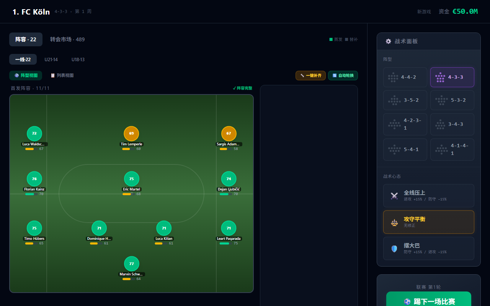
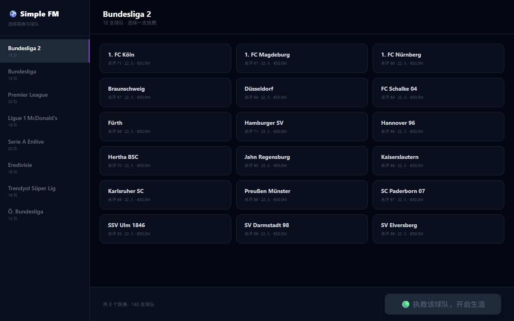

<p align="center">
  
</p>

<h1 align="center">⚽ Simple FM</h1>

<p align="center">
  极简网页足球经理游戏 · 真实球员数据 · 图形化阵型 · 双模式（经理 / 球员生涯）· 现代欧冠赛制
</p>

<p align="center">
  
  
  
  
  
  
</p>

<p align="center">
  <a href="#-快速开始">快速开始</a> ·
  <a href="#-游戏模式">游戏模式</a> ·
  <a href="#-核心玩法系统">核心玩法</a> ·
  <a href="#-比赛引擎">比赛引擎</a> ·
  <a href="#-项目结构">项目结构</a> ·
  <a href="#-测试">测试</a>
</p>

---

## 📸 界面预览

| 选队页面 | 经理仪表盘 | 阵型视图 |
|:---:|:---:|:---:|
|  |  |  |

> 截图来自 E2E 自动化测试（`screenshots/` 目录），UI 迭代后可随时刷新。

## ✨ 特性一览

- **9 大联赛 160 支真实球队**（含西甲皇马 / 巴萨 / 马竞），真实球员数据
- **双模式**：经理模式（全队掌控）+ 生涯模式（Be-a-Pro，AI 教练管理球队）
- **现代欧冠赛制**：36 队联赛阶段 → 附加赛 → 两回合淘汰赛 → 点球大战 → 单场决赛
- **OVR 驱动比赛引擎**：位置加权进球、实力差幂指数模型、豪门声望与欧战权重
- **全赛季真实数据追踪器**：每场比赛实时累加，奖项评选绝不捏造数据
- **深度生涯系统**：转会 / 租借 / 退役 / 青训 / 荣誉 / 传奇评价 / 挂靴谢幕页
- **移动端响应式**：选队页纵向堆叠 + 横向联赛标签栏，桌面端经典双栏

## 🚀 快速开始

```bash
# 环境要求：Node.js 20+

npm install           # 安装依赖
npm run dev           # 开发服务器 → http://localhost:5173
npm run build         # 生产构建 → dist/
```

游戏存档自动保存于浏览器 `localStorage`，支持旧版本存档兼容迁移。

## 🎮 游戏模式

### 🏟️ 经理模式

选队（9 联赛 160 队）→ 图形化排兵布阵（8 阵型 × 3 战术）→ 逐轮模拟 → 转会市场 / 梯队管理 → 赛季结算 → 欧战 → 新赛季。

### 🧑 生涯模式

创建球员（属性滑动条 + 实时 OVR 预览）→ 选择俱乐部 → AI 教练排阵 → 一键模拟赛季（智能暂停节奏）→ 成长与生涯事件 → 荣誉与退役。

## 🏆 核心玩法系统

| 系统 | 说明 |
|---|---|
| **转会生态** | 豪门求购（俱乐部 + €200M 上限转会费）、年轻潜力股租借（荷甲/德乙等锻炼环境）、AI 教练自动引援（伤停/老化/缺口触发，青训提拔优先） |
| **球员生命周期** | 35 岁起老将自主退役、每赛季末 U21 青训造血（豪门可出 90+ POT 妖人）、挂靴退役二次确认 → 生涯荣誉谢幕页（时间轴/峰值/奖杯墙/传奇评价） |
| **年度奖项** | 金球奖（五大联赛豪门资格 + 动态降级 + 断层直通，永不空缺）、金靴必入最佳阵容、最佳 4-3-3 阵容 |
| **颁奖典礼** | 赛季战绩快照（真实胜平负）、欧战成绩、我的赛季数据卡、欧冠冠军专属捧杯动效 |
| **欧战** | UCL/UEL/UECL 三线赛事、联赛阶段积分榜、点球大战、淘汰出局先汇报后结算 |

## ⚙️ 比赛引擎

- **OVR 驱动胜率模型**：进球期望 ∝ (攻/防)^4.5，豪门对弱队期望胜率 75-90%+，豪门赛季积分 80-100 区间
- **位置与属性加权进球**：前锋占 ≥85% 进球、中场 2-10 球区间、后卫强衰减（真实射手分布）
- **进球效率校准**：场均总进球 2.0-3.2 球、单场单队 6 球封顶、顶级前锋单季 28-42 球
- **位置关键度加权**：防守 = 门将 25% + 后卫 60%（弱门将不压垮豪华防线）；客串硬限制 ≤1 人
- **AI 阵型多样化**：每赛季随机阵型/战术；点球大战（5 轮 + 突然死亡）

## 🗂️ 项目结构

```
src/
├── types/game.ts              # 核心类型
├── utils/                     # 纯函数引擎与工具（比赛引擎/世界生成/欧战/转会/追踪器/青训…）
├── store/useGameStore.ts      # Zustand 全局状态（全部游戏逻辑）
├── data/                      # 160 队数据库 / 联赛规则 / 西甲数据 / 导入管线
├── components/                # UI 组件（仪表盘/战术板/谢幕页/选队…）
└── App.tsx                    # 路由（SETUP / PLAYING / RETIRED）
tests/                         # 单元 / 生涯 / 矩阵 / 压力 / E2E 测试
scripts/                       # 数据工具脚本（外部球员导入等）
```

## 🧪 测试

```bash
npm test               # 单元测试（6000+ 断言）
npm run test:career    # 生涯模式全链路
npm run test:matrix    # 9 联赛 × 2 模式 × 2 赛季矩阵
npm run test:stress    # 无头压力自运转（死锁/数据审计）
npm run test:e2e       # Playwright 浏览器 E2E
```

## 🛠️ 技术栈

[React 19](https://react.dev) · [TypeScript](https://www.typescriptlang.org) · [Vite](https://vite.dev) · [Tailwind CSS 4](https://tailwindcss.com) · [Zustand 5](https://zustand.docs.pmnd.rs) · [tsx](https://tsx.is) · [Playwright](https://playwright.dev)

## 📊 数据说明

球队与球员数据来源于 `teams_output.json`（160 队）与 `free_agents_output.json`（自由球员池）。根目录下的 `*.csv` 与 `convert*.py` 为原始数据与转换脚本（数据管线来源），游戏运行时仅依赖生成的 JSON。

## 📄 许可证

[MIT](./LICENSE) © 2026 Simple FM Contributors
